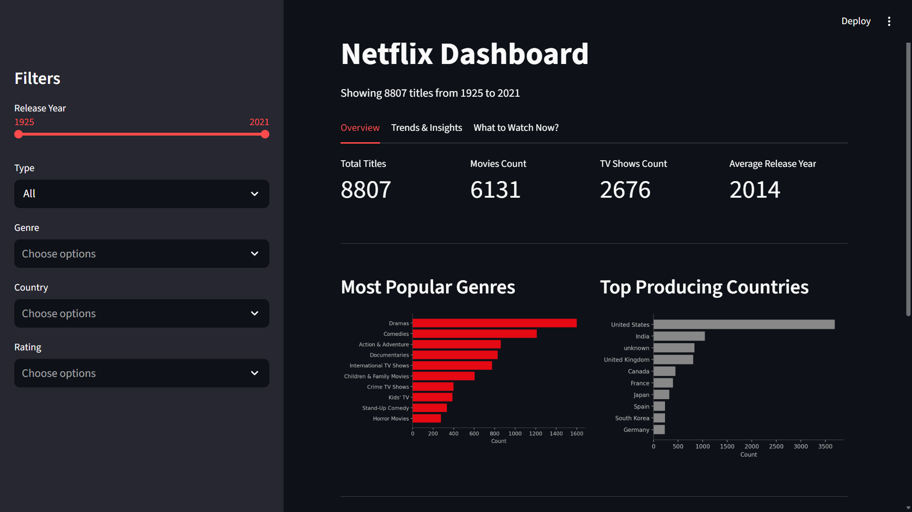
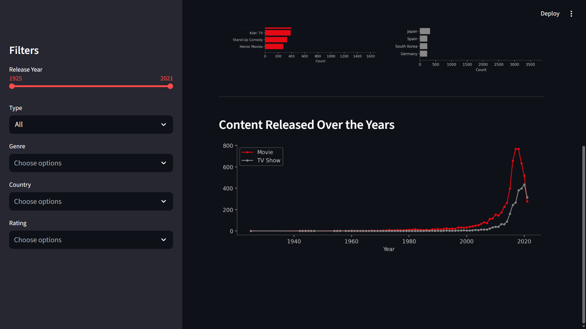
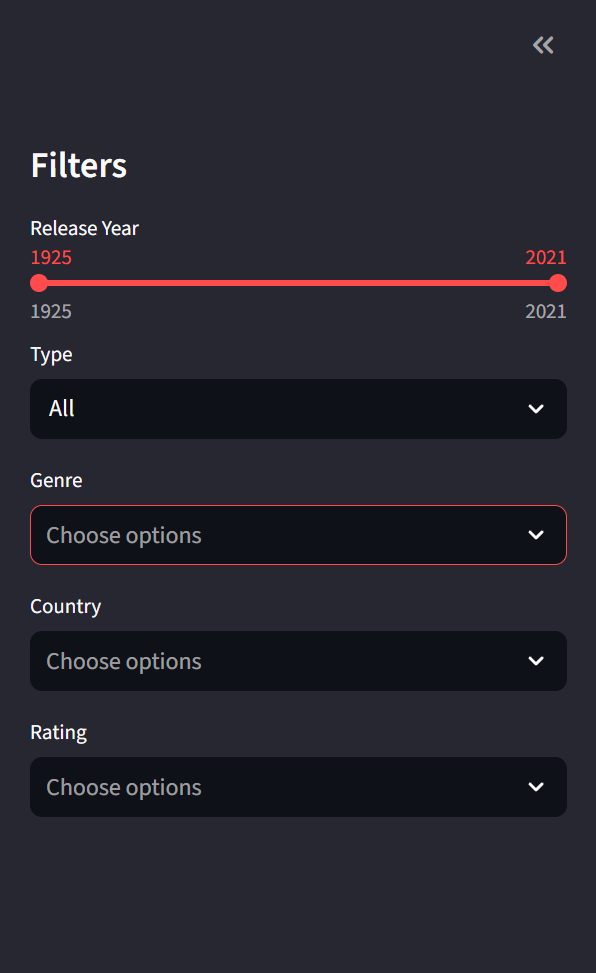

# Title: Netflix Content Strategy Analyzer Insights into Global Streaming Trends

## Project Overview
This project was developed as part of my **Infosys internship program**.

The main goal of this project is to analyze Netflix’s global content dataset and understand trends in content release, genres, ratings, and country-wise content strategy.

I built this as an **interactive Streamlit dashboard with 3 main tabs**, where each tab focuses on different analysis and user interaction features.


---

## Dashboard Modules

### Tab 1: Overview
- Total titles, movies, and TV shows count
- Top genres
- Top producing countries
- Content released over the years
- Filter-based dashboard metrics

## Screenshots
# Dashboard overview




### Tab 2: Trends & Insights
- Top genre per year
- Audience ratings distribution
- Production type analysis
- Genre trends over time
- Release gap distribution
- Duration distribution
- Release speed analysis

## Screenshots
# Trends and Insights


### Tab 3: What Should I Watch Right Now?
This is the most interesting application feature I developed.

This tab gives **Netflix content suggestions based on the user’s time of day**, making the dashboard more practical and user-focused instead of only showing charts.

It acts like a **mini recommendation-style feature built on top of the analyzed dataset**, which adds an application use case to the project.

## Screenshots


---

## Tech Stack
- Python
- Streamlit
- Pandas
- Matplotlib
- CSV Dataset Processing
- Python Datetime Module
- Regex (`re`)
- OS Module (`os`)
- Data Caching
- Multi-tab Dashboard UI

---

## Features
- Interactive 3-tab dashboard
- Sidebar filters
- Genre and country insights
- Rating distribution charts
- Time-based recommendation feature
- Data preprocessing
- Trend analysis
- Visual storytelling with charts

---

## How to Run
```bash
git clone https://github.com/suhss-23/Netflix-Content-Strategy-Analyzer-Insights-into-Global-Streaming-Trends.git
cd Netflix-Content-Strategy-Analyzer-Insights-into-Global-Streaming-Trends
pip install -r requirements.txt
streamlit run src/app.py
```


[def]: screenshots/overview-1.png